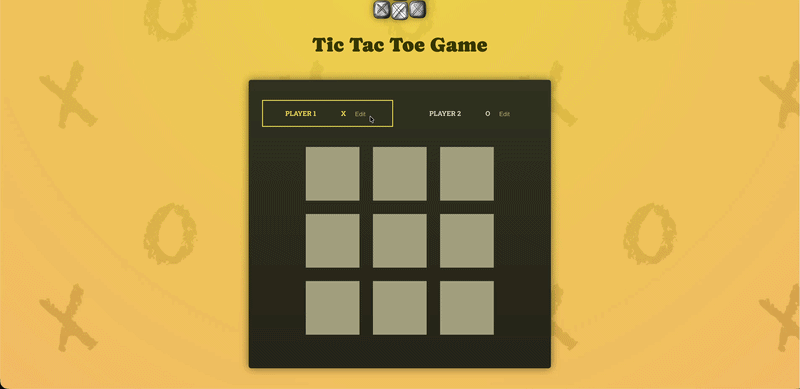
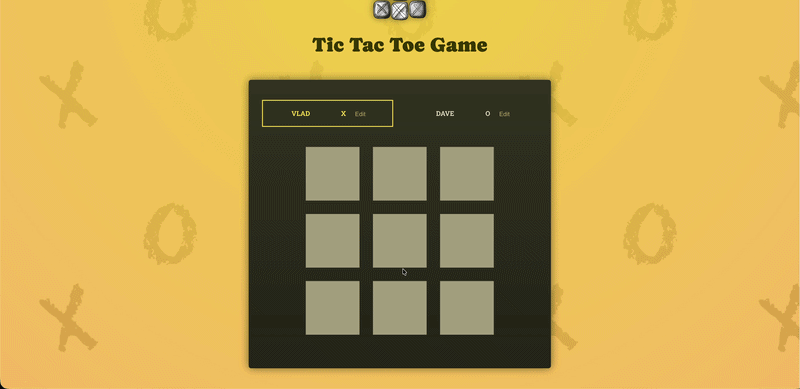

# Tic Tac Toe React Project

[]()
[]()
[]()
[]()
[]()
[]()

A polished Tic Tac Toe game built as part of the React Essential Deep Dive course from Maximilian Schwarzmüller Full React Course. This project demonstrates the core concepts of React development, including component architecture, state management, user interactions, and application styling.



## Live Preview

[View the live application here](https://vlad-tictactoe.netlify.app)



## Project Overview

This portfolio project is a fully interactive Tic Tac Toe game that allows two players to play against each other on the same device. The game includes win detection, draw handling, and a simple user interface that reflects the current game state.

## Features

- **Interactive Player Profiles:** Real-time two-way binding allows users to edit and save custom player names during the match.
- **Dynamic Game Board:** Multi-dimensional array rendering dynamically updates the grid based on the current application state.
- **Turn & History Tracking:** A comprehensive game log automatically records and displays every move sequentially.
- **Automated Game Logic:** Instant calculation of winning combinations and draw scenarios.
- **Match Reset:** Seamless rematch functionality that clears the board without requiring a page reload.

## Architectural Overview

The application is structured around a centralized state management pattern, ensuring scalability, maintainability, and a clear separation of concerns. The architecture strictly follows modern React design principles:

- **Single Source of Truth:** The root `App` component manages a minimalistic state (game turns and player names). All other necessary data is dynamically computed during the render phase.
- **Derived State:** To avoid intersecting and redundant states, variables such as the active player, the current state of the game board, and win/draw conditions are derived entirely from the `gameTurns` array.
- **Immutable State Updates:** Strict adherence to immutability is maintained. Multi-dimensional arrays and objects are deeply copied before any modifications, ensuring predictable and bug-free React reconciliation.
- **Component Composition:** The UI is constructed using isolated, highly reusable components utilizing React Fragments to avoid unnecessary DOM nodes.

## Technologies Used

- React 18+ (Hooks, Functional Components, JSX)
- Vite
- JavaScript (ES6+)
- CSS Modules for styling

## Techniques and Concepts

- Functional React components
- Component composition and reuse
- Local component state with `useState`
- Event handling for user interactions
- Conditional rendering for UI status messages
- Immutable state updates for game board changes
- Basic game logic and winner validation
- Responsive layout design with CSS

## Folder Structure

- `src/`
  - `App.js` - Main application component and game container
  - `index.js` - Application entry point
  - Additional component files as needed for game structure
- `README.md` - Project documentation

## Installation

1. Clone the repository
2. Navigate to the project folder
3. Install dependencies with:
   ```bash
   npm install
   ```
4. Start the development server:
   ```bash
   npm run dev
   ```

## Usage

- Open the app in a browser
- Change and save your nickname
- Click on an empty square to place `X` or `O`
- Watch the status text update to show the current player
- When a player wins or the game ends in a draw, the result is displayed

## Portfolio Notes

This Tic Tac Toe project is a strong example of React fundamentals in a compact and user-friendly application. It highlights the ability to build interactive interfaces, manage state cleanly, and implement game logic within a modern frontend framework.

## Learning Outcomes

- Mastery of complex React state structures and executing state updates correctly based on previous state snapshots.
- Implementation of Prop Forwarding and dynamic component types to build highly flexible UI elements.
- Deep understanding of Two-Way Binding and controlled components for handling user input.
- Efficient rendering and mutation-free updating of multi-dimensional lists in JavaScript.
- Advanced state architecture techniques: Lifting state up, deriving computed values, and identifying/eliminating unnecessary state variables.

## Future Improvements

- Add AI opponent mode
